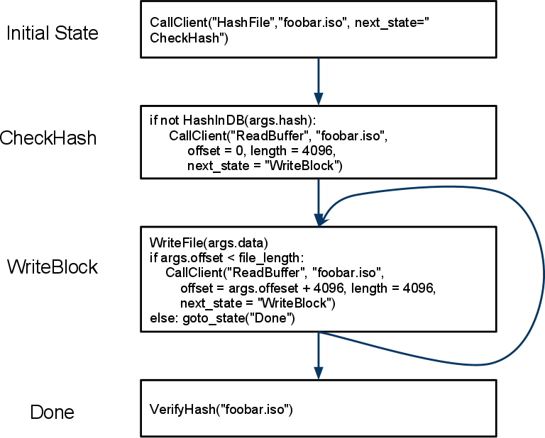
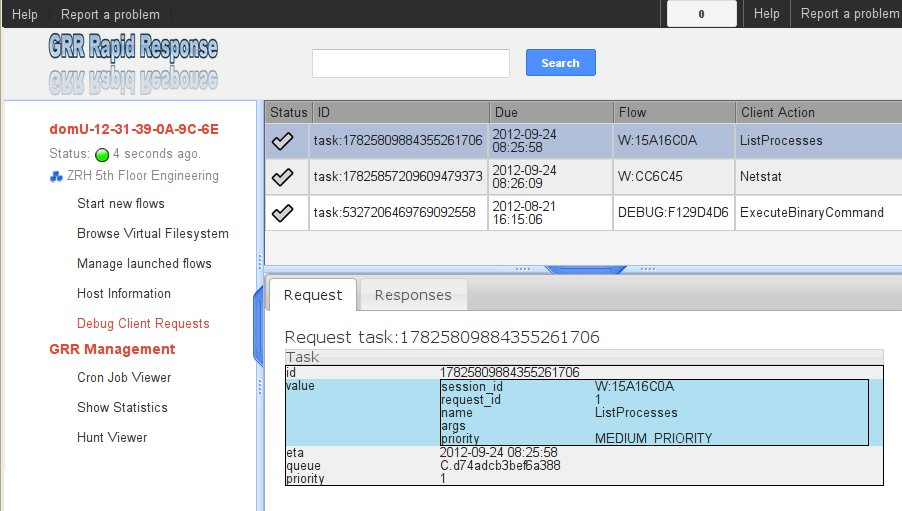
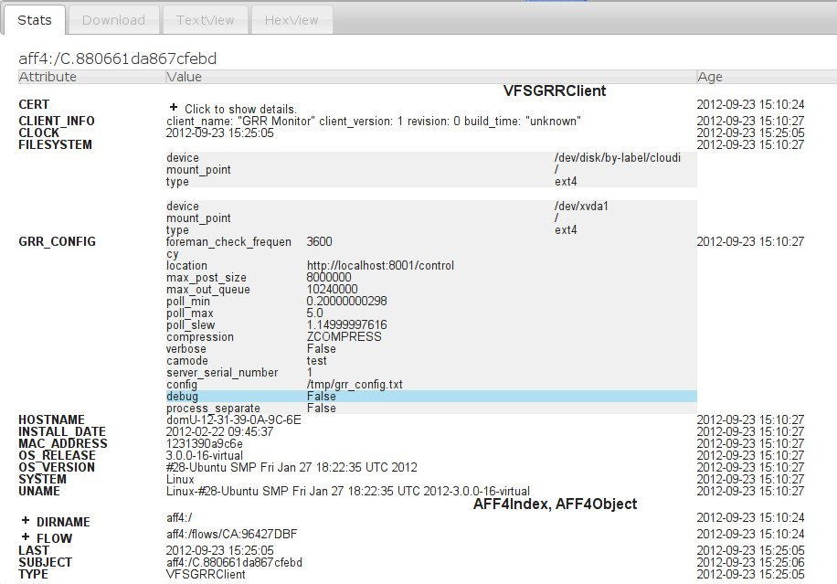
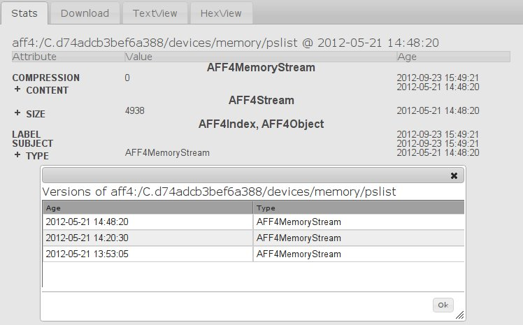

GRR Developer documentation
===========================
:toc:
:toc-placement: preamble
:icons:

GRR is forensic framework focused on scalability enabling powerful analysis. To
achieve this it has a lot of moving parts and a rich API. This document examines
each subsystem and explains how they interact. We then proceed to examine the
implementation from a developer's point of view, to assist external contributors
to come up to speed with the code-base.

GRR Component Overview
----------------------

The following describes the components that make up the GRR system. Since GRR is
designed to be scalable, each component can exist on its own machine in the data
center. Alternatively, for smaller installations, each component can run as a
separate server process, or even all components can run inside the same process
in different threads.

.GRR Component overview
[caption="Figure 1: "]

The main components are:

Client::
The GRR client agent is deployed on corporate assets using the usual mechanism
for software distribution and updates (e.g. SMS, apt). The client communicates
with the front-end server using a HTTP POST request. The request sends and
receives 'GRR messages' from the server (more detail on this below). All
communication with the front end servers is encrypted.

Front End Servers::
The front end servers' main task is to decrypt POST requests from the client,
un-bundle the contained messages and queue these on the data store. The front
end also fetches any messages queued for the client and sends them to the
client.

Datastore::
The data store acts both as a central storage component for data, and as a
communication mechanism for all the components. The data is modeled after an RDF
datastore using the AFF4 data model (See <<datamodel,AFF4 Data Model>>).

Console::
The console is the central application which enables the incident responder or
forensic analyst to interact with the system. The console allows for analysis
tasks to be queued for the clients, and results of previous stored analysis to
be examined. GRR has both a GUI and a text based console application.

Worker::
In order to remain scalable, the front end does not do any processing of data,
preferring to offload processing to special worker components. The number of
workers can be tuned in response to increased workload. Workers typically check
queues in the data stores for responses from the client, process those and
re-queue new requests for the clients (See <<Flows>> and <<Queues>>).

GRR Messages
------------

On the wire, the client and server interchange messages. We term the messages
sent from server to the client 'requests', while messages sent from the client
to the server are 'responses'. Requests sent to the client ask the client to
perform some action, for example 'ListDirectory'. We term these actions the
'client action'. A single request may elicit multiple responses.

For example, the request message 'ListDirectory' will elicit a response for each
file in the directory (potentially thousands). Requests and responses are
tracked using an incremental 'request_id' and 'response_id'.

In order to indicate when all responses have been sent for a particular request,
the client sends a special STATUS message as the last response. In the event of
errors, the message contains details of the error (including backtrace). If the
action completed successfully, an OK status is returned.

Messages are encoded as GrrMessage protobufs:

.Important GRR Message protobuf fields.
|=============================================================================
|session_id     |A unique integer for all packets generated by this flow.
|name           |The name of the Action to be called on the client (See below).
|args           |A serialized protobuf which will be interpreted by the Action.
|request_id     |An incrementing number of this request (see below)
|response_id    |An incrementing number of the response (see below)
|=============================================================================

.Typical Message Request/Response Sequence.
[caption="Figure 2: "]

Figure 2 illustrates a typical sequence of messages. Request 1 was sent from the
server to the client, and elicited 3 responses, in addition to a status message.

When the server sends the client messages, the messages are tagged in the data
store with a lease time. If the client does not reply for these requests within
the lease time, the requests become available for lease again. This is designed
for the case of the client rebooting or losing connectivity part way through
running the action. In this case, the request is re-transmitted and the action
is run again.

Client Communication and Encryption
~~~~~~~~~~~~~~~~~~~~~~~~~~~~~~~~~~~
TBD

[[Flows]]
Flows.
------

Typically when we want to run an analysis on the client, we need to go through a
process where a number of requests are issued, their responses are examined, and
new requests are issued. This round trip to the client may happen many times.

It is inefficient to dedicate server resources to wait for the client to
complete any particular request. The client may lose connectivity or disappear
at any time and leave server resources (such as memory) in use for a prolonged
period.

GRR solves this problem by using a suspendable execution model. We term this
construct a 'Flow'. The flow is a state machine which receives responses to
requests into well defined 'state methods'. The flow object can be pickled
(serialized) between state executions to disk. This allows the server to suspend
the current execution flow with the client indefinitely with no server resources
committed.

.An example flow to fetch a file from the client.
[caption="Figure 4: "]

Figure 4 illustrates a typical flow:

1. We begin in the 'Start' state, where we issue a request to the client to
calculate the hash of a file. The responses to the request (when they arrive
back from the client) will be fed into the 'CheckHash' state. Once the requests
are sent, the flow can be serialized indefinitely.

2. When the hash response arrives from the client, if we do not have the hash
in the database (i.e. we do not have a copy of this file), the flow will issue a
'ReadBuffer' request for the first buffer of the file.

3. When the response is returned, the buffer is written to disk and the next
buffer is requested.

4. Once the entire length of the file is retrieved, we can verify the buffer
hash and complete the flow.

[NOTE]
=============================================================================
The above flow is rather inefficient since it requires a round trip for each
buffer fetched. In practice, the 'GetFile' flow will queue up a full window of
'ReadBuffer' requests in order to make better use of client bandwidth.

When designing real flows, it is always necessary to minimize round trips.
=============================================================================

Since multiple flows can run simultaneously on the same client, it is necessary
to be able to distinguish between flows. Flows have a 'session_id' which is a
randomly generated ID to designate all requests and responses belonging to this
flow. The client simply copies the session id from requests to any responses it
generates, to ensure they will arrive at the respective flow. For example, a
session id may be `W:1213243AE'.

Life of a Flow
~~~~~~~~~~~~~~

This section will attempt to explain the lifecycle of a typical flow that talks
to a client. It will discuss the various queues involved in scheduling actions.
Understanding this process is critical to understanding how to debug the GRR
system.

Well Known Flows and the Event System
~~~~~~~~~~~~~~~~~~~~~~~~~~~~~~~~~~~~~

The GRR client receives requests with a flow session id, which it copies to the
response. This session id is used to route the response to the correct
flow. This means that typically, the client is unable to just send a message
into any running flow, since it would require guessing the session id for the
flow. This is a good thing since it protects flows from malicious clients.

However, there is a need sometimes for the client to send unsolicited messages
to the server (for example during enrollment). In order for the responses to be
routed they must have a correct session id.

The solution is to have a second class of flows on the server called 'Well Known
Flows'. These flows have a well known session id so messages can be routed to
them without the flow needing to send requests for them first. Since any client
or server can send messages to a well known flow, it is impossible for these to
maintain state (since its the same instance of the flow used to process many
clients' messages. Therefore well known flows are stateless.

A well known flow typically is used simply to launch another flow or to process
an event. For example:

[source,python]
------------------------------------------------------------------------
class Enroler(flow.WellKnownFlow):                                      # <1>
  """Manage enrollment requests."""
  well_known_session_id = "CA:Enrol"                                    # <2>

  def ProcessMessage(self, message):
    """Begins an enrollment flow for this client."""
    cert = jobs_pb2.Certificate()                                       # <3>
    cert.ParseFromString(message.args)

    client_id = message.source

    # Create a new client object for this client.
    client = aff4.FACTORY.Create(client_id, "VFSGRRClient", mode="rw",  # <4>
                                 token=self.token)

    # Only enroll this client if it has no certificate yet.
    if not client.Get(client.Schema.CERT):
      # Start the enrollment flow for this client.
      flow.FACTORY.StartFlow(client_id=client_id, flow_name="CAEnroler",# <5>
                             csr=cert, queue_name="CA",
                             _client=client, token=self.token)
------------------------------------------------------------------------

<1> A new well known flow is created by extending the WellKnownFlow baseclass.

<2> The well known session id of this flow is "CA:Enrol". Messages to this queue
will be routed to this flow.

<3> We expect to receive a Certificate protobuf for this flow - this is
essentially a CSR for the requesting client.

<4> We open the AFF4 object for this client.

<5> If this client has no certificate already, we launch the real CAEnroler flow
to talk with this client. Note that the CAEnroler flow is a regular flow with a
random session_id - that ensure no other clients can interfere with this
enrollment request.

On top of the the well known flow system GRR implements an event dispatching
system. This allows any component to declare an event it is interested in, and
have any other component broadcast the event.

For example, when a new client enrolls we wish to run the Interrogate flow
automatically for it (so we can query it for hostname, usernames etc.):

[source,python]
------------------------------------------------------------------------
class EnrolmentInterrogateEvent(flow.EventListener):                  # <1>
  """An event handler which will schedule interrogation on client enrollment."""
  EVENTS = ["ClientEnrollment"]                                       # <2>
  well_known_session_id = "W:Interrogate"

  @flow.EventHandler(source_restriction=lambda x: x=="CA")
  def ProcessMessage(self, message=None, event=None):
    flow.FACTORY.StartFlow(event.cn, "Interrogate", token=self.token) # <3>
------------------------------------------------------------------------

<1> An event listener is a class which extends flow.EventListener.

<2> It will listen to any of these events. Note we also need to have a unique
well_known_session_id since an Event Listener is just a specialized Well Known
Flow.

<3> When an event called "ClientEnrollment" is broadcast, this EventListener
will receive the message and automatically run the Interrogate flow against this
client.

The event can now be broadcast from any other flow:

[source,python]
------------------------------------------------------------------------
class CAEnroler(flow.GRRFlow):
  """Enrol new clients."""
  .....

  @flow.StateHandler(next_state="End")
  def Start(self):
    .....
    # Publish the client enrollment message.
    self.Publish("ClientEnrollment", certificate_attribute.AsProto())
------------------------------------------------------------------------

Rules for Writing Flows
~~~~~~~~~~~~~~~~~~~~~~~

This section contains several guidelines on writing a flow. A flow acts as a
state machine, and a has a number of rules that should be followed to ensure it
behaves in the GRR framework. By following the guidelines you should avoid
common pitfalls.

. Arguments
 * Arguments to flows are defined as semantic protobufs in flows.proto.
 * Setting type will enforce type checking using the corresponding RDFValue.
 E.g. type RegularExpression will ensure the argument value can be compiled as
 a regex.
 * Setting the label ADVANCED will hide the argument from the user in an
 expandable box in Admin UI. Setting the label HIDDEN will hide it entirely from
 the Admin UI.
 * The flow class attribute `args_type` specifies which proto to use for the
 arguments to the flow.

. Flow Help and Visibility
 * Setting the flow class attribute `category` will define where in flow
 hierarchy in the Admin UI the flow will appear. Setting it to None will stop it
 from being visible in the UI.
 * Setting the flow class attribute `behaviours` will affect who sees the flow.
 By default flows are only visible if they user has selected to see Advanced
 flows. Set `behaviours = flow.GRRFlow.behaviours + "BASIC"` to make it visible
 in basic view.
 * Documentation for the flow will be generated from the flow docstring, and by
 analyzing the flow arguments.

. Initialization
 * Don't define an __init__ function, just the Start() function.
 * The Start() function is where you start your work, no heavy lifting should
 happen here. Start() should finish in less than a second as it will be run from
 the UI when you schedule a flow (not from the worker).
 * You should just register any variables and potentially do some fast checks to
 return immediately if something is wrong with the supplied arguments.
 * If you need to do heavy work without calling other flows, e.g. a server only
 flow, you can do a CallState() to delay your work to happen on a worker.
 Note this doesn't provide parallelism, multiple calls to CallState will be run
 in order by a worker.

. State Handling
 * Each state in a flow (indicated by @StateHandler decorator) may (but isn't
 guaranteed to) happen on a completely different machine.
 * Every state requires a decorator to define it as a state.
 * You get to another state by calling CallClient (a client action), CallFlow
 (another flow) or CallState (the same flow) and specifying NextState
 * For every CallXXXXXX call, the function specified in NextState will be called
 exactly once.
 * Instance variables (self.xxx) will not be available across invocations. To
 store variables across states you need to register them via
 self.state.Register, and access them via self.state. Anything that can be
 pickled is supported.
 * If you are writing to the database, you may want to .Flush() or .Close() at
 then end of each state to reduce the size of any stored state. You normally do
 this by overriding self.Load() and self.Save() functions to do this for you,
 as they are invoked whenever a flow is serialized/deserialized from the
 database.

. Errors
 * If your flow fails, you should raise FlowError(error message), but you can
 feel free to raise something else like an IOError if you feel it makes more
 sense.
 * Non-fatal errors should be logged with self.Log()

. Notifications
 * If you don't call self.Notify() and don't override the End() method, the user
 will just get a generic "Flow completed" notification.
 * You normally want to override the End() method and do your notification in
 there if you want to say something custom.
 * If the flow is a child flow, i.e. created from another flow by CallFlow(),
 the notifications will be suppressed. Only the parent flow will notify.

. Chaining Flows
 * You nearly always want to write your flow in a way that can be chained or
 used in a hunt. Others may want to use your flow as part of theirs and don't
 want to reinvent the wheel.
 * You make this work by by calling SendReply() with a RDFValue. You can call it
 multiple times but you should call it with the same protobuf type each time.
 * The most common things to send with SendReply are a RDFURN or a StatEntry.

. Handling Responses
 * Each flow state gets called with a responses object as the argument, the
 object is a little magical as it has attributes and is also an iterable.
 * If responses.success is True, then no error was raised.
 * Iterating over the response object will give you protobuf object each time.
 For a ClientAction the type is specified by out_rdfvalue, otherwise you can
 specify using first param of the @StateHandler to force a type.
 * The number of responses you get directly correlates to the number of times
 the ClientAction or Flow called SendReply().

. Testing
 * Add any tests created to grr/lib/flows/tests.py
 * Flows commonly use client actions. The test framework offers a client-mock to
 automate flow testing defined grr/lib/test_lib.py
 * To test some flows you'll need client-side data, for this you can use a
 client fixture, a fixture contains the client-side implementation of the
 testing code for the client actions.
 * The default fixture for file system related testing is
 ClientVFSHandlerFixture. See grr/test_data/client_fixture.py. It contains the
 AFF4 data of a client defined in Python.

. Deployment
 * If the flow is to be sent to the main codebase, put it in
 grr/lib/flows/general and add it to grr/lib/flows/general/__init__.py
 * Otherwise you can add them to grr/lib/local/ and the __init__.py there to
 keep your local code separate from the main codebase.

[[Hunts]]
Hunts
-----

In order to be able to search for malicious code and abnormal behavior
amongst the entire fleet of clients, GRR has implemented the concept
of hunts. Hunts are essentially flows that run on multiple clients at
the same time.

At the moment hunts are regarded as rather high impact since they can
affect many clients at once, so scheduling new hunts is restricted to
console users. In order to schedule a hunt, this is the process:

Import the hunts file and create a new hunt (This example uses the
SampleHunt, replace with a hunt of your choice):

[source,python]
------------------------------------------------------------------------
hunt = hunts.SampleHunt(client_limit=100, expiry_time=36000)
------------------------------------------------------------------------

This creates the SampleHunt, possible parameters:

- client_limit to limit the number of clients this hunt will be
  scheduled on for experiments.
- expiry_time gives the time this hunt will be active (in seconds).

Next you have to create rules to indicate which clients the hunt will
be run on. Rules either compare fields stored in the client
description to integer values or match regular expressions against
them:

[source,python]
------------------------------------------------------------------------
int_rule = jobs_pb2.ForemanAttributeInteger(
                   attribute_name=client.Schema.OS_RELEASE.name,
                   operator=jobs_pb2.ForemanAttributeInteger.EQUAL,
                   value=7)
regex_rule = flow.GRRHunt.MATCH_WINDOWS
------------------------------------------------------------------------

The two rules above will match clients that run Windows and have an
OS_RELEASE of 7.

Next, you add the rules to the hunt:

[source,python]
------------------------------------------------------------------------
hunt.AddRule([int_rule, regex_rule])
------------------------------------------------------------------------

You can call AddRule more than once. The hunt will be triggered if all
the rules of one AddRule call match at the same time. So you can do:

[source,python]
------------------------------------------------------------------------
hunt.AddRule([ flow.GRRHunt.MATCH_WINDOWS,
  jobs_pb2.ForemanAttributeInteger(attribute_name=client.Schema.OS_RELEASE.name,
  operator=jobs_pb2.ForemanAttributeInteger.EQUAL, value=7)])

hunt.AddRule([ flow.GRRHunt.MATCH_WINDOWS,
  jobs_pb2.ForemanAttributeInteger(attribute_name=client.Schema.OS_RELEASE.name,
  operator=jobs_pb2.ForemanAttributeInteger.EQUAL, value=8)])
------------------------------------------------------------------------

to start a hunt on windows clients that have either OS_VERSION 7 or 8.

If you are unsure about your rules, you can call

[source,python]
------------------------------------------------------------------------
hunt.TestRules()
------------------------------------------------------------------------

This will show you how many clients in the db match your rules and
give you some matching sample clients. Note that this will open all
the clients and will therefore take a while if you have a lot of
clients in the database.

Once you are happy with your rules, you upload the hunt to the
foreman:

[source,python]
------------------------------------------------------------------------
hunt.Run()
------------------------------------------------------------------------

At this point, matching clients will pick up and run the hunt and you
can see the progress in the UI.

If you want to stop a running hunt and remove the foreman rules again, use

[source,python]
------------------------------------------------------------------------
hunt.Stop()
------------------------------------------------------------------------

[[Queues]]
Queues
-------

GRR Supports multiple processing queues on the server. This allows specialized
workers to be used for specific tasks, independently routing all messages to
these workers.

.Processing queues in the GRR architecture.
[caption="Figure 3: "]

For example, figure 3 illustrates three distinct types of workers. The general
purpose workers retrieve messages from the general queue named "W". A
specialized worker responsible for CA enrollments communicates to the client on
the queue "CA", while an interactive worker has its own queue for the client.

It is also possible to run special purpose workers for example for debugging or
special flow processing (i.e. workers with custom flows which are not found in
the standard workers). These workers can be started with the command line
parameter '--worker_queue_name' to specify a custom name. The special worker
will then attach to the regular messaging system and be able to issue flows to
the client without interference from other workers.

Additionally each client has a queue for messages intended to it (i.e. 'client
requests'). This queue can be examined using the 'Debug Client Requests' option
in the GUI:

.Inspecting outstanding client requests.

The figure shows three client requests outstanding for this client. The client
is currently offline and so has requests queued for it when it returns. We can
see two regular requests directed to the queue "W" - a ListProcesses request and
a NetStat request. There is also a special request directed at the queue DEBUG
for ExecuteBinaryRequest.

[[datamodel]]
AFF4 Data Model
---------------

AFF4 was first published in 2008 as an extensible, modern forensic storage
format. The AFF4 data model allows the representation of arbitrary objects and
the association of these with semantic meaning. The AFF4 data model is at the
heart of GRR and is essential for understanding how GRR store, analyzes and
represents forensic artifacts.

AFF4 is an object oriented model. This means that all entities are just
different types of 'AFF4 objects'. An AFF4 object is simply an entity,
addressable by a globally unique name, which has attributes attached to it as
well as behaviors.

Each AFF4 object has a unique urn by which it can be addressed. AFF4 objects
also have optional attributes which are defined in the object's Schema. For
example consider the following definition of an AFF4 object representing a GRR
Client:

[source,python]
------------------------------------------------------------------------
class VFSGRRClient(aff4.AFF4Object):                                   # <1>
  """A Remote client."""

  class SchemaCls(aff4.AFF4Object.SchemaCls):                          # <2>
    """The schema for the client."""
    CERT = aff4.Attribute("metadata:cert", RDFX509Cert,                # <3>
                          "The PEM encoded cert of the client.")

    # Information about the host.
    HOSTNAME = aff4.Attribute("metadata:hostname", aff4.RDFString,     # <4>
                              "Hostname of the host.", "Host",
                              index=client_index)
------------------------------------------------------------------

<1> An AFF4 object is simply a class which extends the AFF4Object base class.

<2> Each AFF4 object contains a Schema - in this case the Schema extends the
base AFF4Object schema - this means this object can contains the attributes on
the base class in addition to these attributes. Attributes do not need to be
set.

<3> Attributes have both a name ("metadata:cert") as well as a type
("RDFX509Cert"). In this example, the VFSGRRClient object will contain a CERT
attribute which will be an instance of the type RDFX509Cert.

<4> An attribute can also be marked as ready for indexing. This means that
whenever this attribute is updated, the corresponding index is also updated.

.View of an AFF4 VFSGRRClient with some of its attributes.

The figure above illustrates an AFF4 Object of type VFSGRRClient. It has a URN
of "aff4:/C.880661da867cfebd". The figure also lists all the attributes attached
to this object. Notice how some attributes are listed under the heading
'AFF4Object' (since they are defined at that level) and some are listed under
'VFSGRRClient' since they are defined under the VFSGRRClient schema.

The figure also gives an 'Age' for each attribute. This is the time when the
attribute was created. Since GRR deals with fluid, constantly changing systems,
each fact about the system must be tagged with the point in time where that fact
was known. For example, at a future time, the hostname may change. In that case
we will have several versions for the HOSTNAME attribute, each correct for that
point in time. We consider the entire object to have a new version when a
versioned attribute changes.

.Example of multiple versions present at the same time.

The Figure above shows a process listing performed on this client. The view we
currently see shows the the process listing at one point in time, but we can
also see a UI offering to show us previous versions of the same object.

AFF4 objects take care of their own serialization and unserialization and the
data store technology is abstracted. Usually AFF4 objects are managed using the
aff4 FACTORY:

------------------------------------------------------------------
In [8]: pslist = aff4.FACTORY.Open("aff4:/C.d74adcb3bef6a388/devices\    <1>
   /memory/pslist", mode="r", age=aff4.ALL_TIMES)

In [9]: pslist                                                           <2>
Out[9]: <AFF4MemoryStream@7F2664442250 = aff4:/C.d74adcb3bef6a388/devices/memory/pslist>

In [10]: print pslist.read(500)                                          <3>
 Offset(V) Offset(P)  Name                 PID    PPID   Thds   Hnds   Time
---------- ---------- -------------------- ------ ------ ------ ------ -------------------
0xfffffa8001530b30 0x6f787b30 System                    4      0     97    520 2012-05-14 18:21:33
0xfffffa80027119d0 0x6e5119d0 smss.exe                256      4      3     33 2012-05-14 18:21:34
0xfffffa8002ce3060 0x6dee3060 csrss.exe               332    324      9    611 2012-05-14 18:22:25
0xfffffa8002c3

In [11]: s = pslist.Get(pslist.Schema.SIZE)                             <4>

In [12]: print type(s)                                                  <5>
<class 'grr.lib.aff4.RDFInteger'>

In [13]: print s                                                        <6>
4938

In [14]: print s.age                                                    <7>
2012-05-21 14:48:20

In [15]: for s in pslist.GetValuesForAttribute(pslist.Schema.SIZE):     <8>
   ....:     print s, s.age
4938 2012-05-21 14:48:20
4832 2012-05-21 14:20:30
4938 2012-05-21 13:53:05
------------------------------------------------------------------

<1> We have asked the aff4 factory to open the AFF4 object located at the unique
location of 'aff4:/C.d74adcb3bef6a388/devices/memory/pslist' for reading. The
factory will now go to the data store, and retrieve all the attributes which
comprise this object. We also indicate that we wish to examine all versions of
all attributes on this object.

<2> We receive back an AFF4 object of type 'AFF4MemoryStream'. This is a stream
(i.e. it contains data) which stores all its content in memory.

<3> Since it is a stream, it also implements the stream interface (i.e. supports
reading and seeking). Reading this stream gives back the results from running
Volatility's pslist against the memory of the client.

<4> The SIZE attribute is attached to the stream and indicates how much data is
contained in the stream. Using the Get() interface we retrieve the most recent
one.

<5> The attribute is strongly typed, and it is an instance of an RDFInteger.

<6> The RDFInteger is able to stringify itself sensibly.

<7> All attributes carry the timestamp when they were created. The last time the
SIZE attribute was updated was when the object was written to last.

<8> We can now retrieve all versions of this attribute - The pslist flow was run
on this client 3 times at different dates. Each time the data is different.

Client Path Specifications
--------------------------

One of the nice things about the GRR client is the ability to nest file
readers. For example, we can read files inside an image using the sleuthkit and
also directly through the API. We can read registry keys using REGFI from raw
registry files as well as using the API. The way this is implemented is using a
pathspec.

Pathspecs
~~~~~~~~~

The GRR client has a number of drivers to virtualize access to different
objects, creating a Virtual File System (VFS) abstraction. These are called 'VFS
Handlers' and they provide typical file-like operations (e.g. read, seek, tell
and stat). It is possible to recursively apply different drivers in the correct
order to arrive at a certain file like object. In order to specify how drivers
should be applied we use 'Path Specifications' or pathspecs.

Each VFS handler is constructed from a previous handler and a pathspec. The
pathspec is just a collection of arguments which make sense to the specific VFS
handler. The type of the handler is carried by the pathtype parameter:

pathtype: OS::
    Implemented by the grr.client.vfs_handlers.file module is a VFS Handler for
    accessing files through the normal operating system APIs.

pathtype: TSK::
    Implemented by the grr.client.vfs_handlers.sleuthkit module is a VFS Handler
    for accessing files through the sleuthkit. This Handle depends on being
    passed a raw file like object, which is interpreted as the raw device.

pathtype: MEMORY::
    Implemented by the grr.client.vfs_handlers.memory module is a VFS Handler
    implementing access to the system's raw memory. This is used by the
    volatility plugins for memory analysis.

A pathspec is a list of components. Each component specifies a way to derive a
new python file-like object from the previous file-like object. For example,
image we have the following pathspec:

        path:   /dev/sda1
        pathtype: OS
        nested_path: {
           path: /windows/notepad.exe
           pathtype: TSK
        }

This opens the raw device /dev/sda1 using the OS driver. The TSK driver is then
given the previous file like object and the nested pathspec instructing it to
open the /windows/notepad.exe file after parsing the filesystem in the previous
step.

This can get more involved, for example:

   path:   /dev/sda1
   pathtype: OS
   nested_path: {
      path: /windows/system32/config/system
      pathtype: TSK
      nested_path: {
         path: SOFTWARE/MICROSOFT/WINDOWS/
         pathtype: REGISTRY
     }
   }

Which means to use TSK to open the raw registry file and then REGFI to read the
key from it (note that is needed because you generally cant read the registry
file while the system is running).

Pathspec transformations
~~~~~~~~~~~~~~~~~~~~~~~~

The pathspec tells the client exactly how to open the required file, by nesting
drivers on the client. Generally, however, the server has no prior knowledge of
files on the client, therefore the client needs to transform the server request
to the pathspec that makes sense for the client. The following are the
transformations which are applied to the pathspec by the client.

File Case Correction and path separator correction
^^^^^^^^^^^^^^^^^^^^^^^^^^^^^^^^^^^^^^^^^^^^^^^^^^

Some filesystems are not case sensitive (e.g. NTFS). However they do preserve
file cases. This means that the same pathspecs with different case filename will
access the same file on disk. This file however, does have a well defined and
unchanging casing. The client can correct file casing, e.g.:

  path: c:\documents and settings\
  pathtype: OS

Is corrected to the normalized form:

  path: /c/Documents and Settings/
  pathtype: OS

Filesystem mount point conversions
^^^^^^^^^^^^^^^^^^^^^^^^^^^^^^^^^^

Sometimes the server requires to read a particular file from the raw disk using
TSK. However, the server generally does not know where the file physically
exists without finding out the mounted devices and their mount points. This
mapping can only be done on the client at request runtime. When the top level
pathtype is TSK, the client knows that the server intends to read the file
through the raw interface, and therefore converts the pathspec to the correct
form using the mount points information. For example:

  path: /home/user/hello.txt
  pathtype: TSK

Is converted to:

   path: /dev/sda2
   pathtype: OS
   nested_path: {
         path: /user/hello.txt
         pathtype: TSK
   }

UUIDs versus "classical" device nodes
^^^^^^^^^^^^^^^^^^^^^^^^^^^^^^^^^^^^^

External disks can easily get re-ordered at start time, so that path specifiers
containing /dev/sd? etc. may not be valid anymore after the last reboot. For
that reason the client will typically replace /dev/sda2 or similar strings with
/dev/disk/by-uuid/[UUID] on Linux or other constructions (e.g. pathtype: uuid)
for all clients.

Life of a client pathspec request
~~~~~~~~~~~~~~~~~~~~~~~~~~~~~~~~~

How are the pathspecs sent to the client and how are they related to the aff4
system. The figure below illustrates a typical request - in this case to list a
directory:

1. A ListDirectory Flow is called with a pathspec of:

   path: c:\docume~1\bob\
   pathtype: OS

2. The flow sends a request for the client action ListDirectory with the
provided pathspec.

3. Client calls VFSOpen(pathspec) which opens the file, and corrects the
pathspec to:

  path: c:\Documents and Settings\Bob\
  pathtype: OS

4. Client returns StatResponse for this directory with the corrected pathspec.

5. The client AFF4 object maps the pathspec to an AFF4 hierarchy in the AFF4
space. The server flow converts from client pathspec to the aff4 URN for this
object using the PathspecToURN() API. In this case a mapping is created for
files read through the OS apis under */fs/os/*. Note that the AFF4 URN created
contains the case corrected - expanded pathspec:

   urn = GRRClient.PathspecToURN(pathspec)
   urn = aff4:/C.12345/fs/os/c/Documents and Settings/Bob

6. The server now creates this object, and stores the corrected pathspec as a
STAT AFF4 attribute.

Client pathspec conversions can be expensive so the next time the server uses
this AFF4 object for a client request, the server can simply return the client
the corrected pathspec. The corrected pathspec has the LITERAL option enabled
which prevents the client from applying any corrections.

Foreman
-------

The Foreman is a client scheduling service. At a regular intervals (defaults to
every 50 minutes) the client will report in asking if there are Foreman actions
for it. At the time of this check in, the Foreman will be queried to decide if
there are any jobs that match the host, if there are, appropriate flows will be
created for the client. This mechanism is generally used by Hunts to schedule
flows on a large number of clients.

The foreman maintains a list of rules, if the rule matches a client when it
checks in, the specified flow will execute on the client. The rules work against
AFF4 attributes allowing for things like "All XP Machines" or "All OSX machines
installed after 01.01.2011".

The foreman check-in request is a special request made by the client that
communicates with a Well Known Flow (W:Foreman). When the server sees this
request it does the following:

. Determines how long since this client did a Foreman check-in.
. Determines the set of rules that are non-expired and haven't previously been
checked by the client.
. Matches those rules against the client's attributes to determine if there is a
 match.
. If there is a match, run the associated flow.

The reason for the separate Foreman check-in request is that the rule matching
can be expensive when you have a lot of clients, so having these less frequent
saves a lot of processing.

Reporting
---------

The current (September 2012) reporting capabilities of GRR are very limited. We
have a small set of reports defined in lib/aff4_objects/reports.py that can be
used and serve as examples for extension. There is no UI for these components
currently, but they can be run from the Console.

------------------------------------------------------------------
r = reports.ClientListReport(access_control.ACLToken())            <1>
r.Run()                                                            <2>
r.MailReport("joe@mailinator.com")                                 <3>
open("client_list.csv", "w").write(r.AsCsv())                      <4>
------------------------------------------------------------------

<1> Create a report that lists all clients and gives basic information about
them. We pass an empty authorization token.
<2> Run the report. This opens all client objects, so may take some time if you
have a lot of clients.
<3> Mail the output of the report to joe@mailinator.com.
<4> Dump the CSV output of the report to client_list.csv.

Using these report classes as a basis, it should be relatively easy to extend
the reports to do whatever you need.

Authorization and Auditing
--------------------------

GRR contains support for a full authorization and audit API (even for console
users) and is implemented in an abstraction called a Security Manager.
This Security Manager shipped with GRR (September 2012) does not make use of
these APIs and is open by default. However, a deployment may build their own
Security Manager which implements the authorization semantics they require.

This infrastructure is noticeable throughout much of the code, as access to any
data within the system requires the presence of a "token". The token contains
the user information and additionally information about the authorization of the
action. This passing of the token may seem superfluous with the current
implementation, but enables developers to create extensive audit capabilities
and interesting modes of authorization.

By default, GRR should use data_store.default_token if one is not provided. To
ease use this variable is automatically populated by the console if --client is
used.

Token generation is done using the access_control.ACLToken.

[source, python]
------------------------------------------------------------------
token = access_control.ACLToken()
fd = aff4.FACTORY.Open("aff4:/C.12345/", token=token)
------------------------------------------------------------------

Developer Information
---------------------

The following examples detail how developers can extend the GRR framework for
implementing new features.

=== Adding Flows ===

The most common task is to add a new flow. The following is an example of a
non-trivial flow from the GRR source code:

.A sample flow for analyzing client memory using Volatility (abridged and annotated).
[source,python]
------------------------------------------------------------------
class AnalyzeClientMemory(flow.GRRFlow):                   # <1>
  category = "/Memory/"                                    # <2>

  def __init__(self, plugins="pslist,dlllist,modules", driver_installer=None,
               profile=None, **kwargs):
    super(AnalyseClientMemory, self).__init__(**kwargs)
    self.plugins = plugins
    self.driver_installer = driver_installer
    self.profile = profile

  @flow.StateHandler(next_state=["RunVolatilityPlugins"])  # <3>
  def Start(self):
    self.CallFlow("LoadMemoryDriver", next_state="RunVolatilityPlugins",
                  driver_installer=self.driver_installer)

  @flow.StateHandler(next_state="ProcessVolatilityPlugins")
  def RunVolatilityPlugins(self, responses):
    if responses.success:
      memory_information = responses.First()

      self.CallFlow("VolatilityPlugins", plugins=self.plugins,
                    device=memory_information.device, profile=self.profile,
                    next_state="End")                      # <4>
    else:
      raise flow.FlowError("Failed to Load driver: %s" % responses.status)

  @flow.StateHandler()
  def End(self):
    self.Notify("ViewObject", self.device_urn,
                "Completed execution of volatility plugins.")
------------------------------------------------------------------

<1> A flow is simply a class which extends flow.GRRFlow.
<2> By specifying a category, the GUI can use this flow automatically.
<3> A state method is decorated with the 'StateHandler' decorator. This also
specifies all the possible other states that can be transitioned from this
state.
<4> The 'CallFlow' method delegates execution to another flow. The responses
from this flows will be fed back into the End state.

==== Adding a new flow source file ====
To add a new flow source file:
1. Create the source file in lib/flows/general/, e.g. my_flow.py
2. Add an import statement to lib/flows/general/__init__.py, e.g
[source,python]
------------------------------------------------------------------
from grr.lib.flows.general import my_flow
------------------------------------------------------------------

==== Writing a new flow ====
1. Create the flow class:

[source,python]
------------------------------------------------------------------
class MyFlow(flow.GRRFlow):
  """List the Volume Shadow Copies on the client."""
------------------------------------------------------------------

2. Define the category the flow is part of:

[source,python]
------------------------------------------------------------------
  category = "/Filesystem/"
------------------------------------------------------------------

3. Define the flow type information. The web-based UI will generate
the necessary flow parameters input files based on the flow type
information.

[source,python]
------------------------------------------------------------------
flow_typeinfo = type_info.TypeDescriptorSet(
  ...
)
------------------------------------------------------------------

4. Define the Start state handler.

[source,python]
------------------------------------------------------------------
  @flow.StateHandler()
  def Start(self, unused_response):
------------------------------------------------------------------

In the example above the flow only consists of the Start state handler
and therefore only state handler is defined. As you can see in the
AnalyzeClientMemory example provided earlier is it possible to chain
state handlers with next_state="MyNextState". The name of the first
state handler is Start. Multiple states can be defined as a list e.g.
["MyNextState1", "MyNextState2", ...]. Results from one state to
another are passed via the response argument.

[source,python]
------------------------------------------------------------------
  @flow.StateHandler()
  def MyNextState(self, response):
------------------------------------------------------------------

The last state handler called that is always called is the End state
handler, by default it return a generic "Flow completed" response.
The End state handler can be overwritten to return more detailed status
information. The End state handler does not need to be explicitly defined
as a next state.

== Testing ==

We aim to keep GRR well unit tested to ensure we can move quickly with new
changes without unknowingly breaking things. Different pieces of the system
are tested to different levels of rigour, but generally new functionality
should not go in without a test.

=== Running the Tests ===
To run the tests there are a few dependencies you'll need to make sure are
sorted.

Testing the admin interface requires the webdriver/selenium framework.
First you need to install the framework and chrome driver, we recommend using:
------------------------------------------------------------------
apt-get install python-pip    # if you don't have it already
sudo pip install selenium
sudo apt-get install libnss3 chromium-browser   # dependency of chromedriver
wget https://chromedriver.googlecode.com/files/chromedriver_linux64_26.0.1383.0.zip
unzip chromedriver*
sudo mv chromedriver /usr/bin/
------------------------------------------------------------------

Use the run_tests.py script to run the unit tests.

------------------------------------------------------------------
joe@host:~/dev/grr$ PYTHONPATH="" python ./grr/run_tests.py
        SchedulerTest                            PASSED in   0.31s
        FlowFactoryTest                          PASSED in   0.41s
        NetstatTest                              PASSED in   0.40s
        SQLiteFileTest                           PASSED in   0.50s
        BackwardsCompatibleClientCommsTest       PASSED in   0.91s
        GrrWorkerTest                            PASSED in   0.61s
        AFF4GRRTest                              PASSED in   0.41s
        ChromeHistoryTest                        PASSED in   0.41s
        AccessControlTest                        PASSED in   0.41s
        ...
        TestAdministrativeFlows                  FAILED in   0.41s
        ...
        TestFileCollector                        PASSED in   2.02s
        TestWebHistory                           PASSED in   1.31s

Ran 75 tests in 8.98 sec, 74 tests passed, 1 tests failed.
------------------------------------------------------------------

To run a specific test name the test class on the command line:
------------------------------------------------------------------
joe@host:~/dev/grr$ PYTHONPATH="" python ./grr/run_tests.py TestAdministrativeFlows
------------------------------------------------------------------

=== Testing the UI ===

Note: If you are doing this on a remote machine over SSH you need to make
sure your X display is forwarded for Selenium, it will spawn a Firefox window
during the tests.

Then run the runtests_test.py script

------------------------------------------------------------------
joe@host:~/dev/grr$ PYTHONPATH="" python ./grr/gui/runtests_test.py
------------------------------------------------------------------

To run a specific test name the test class on the command line:
------------------------------------------------------------------
joe@host:~/dev/grr$ PYTHONPATH="" python ./grr/gui/runtests_test.py TestTimelineView
------------------------------------------------------------------

==== Debugging GUI Tests ====
Selenium will instrument the browser flow, but to figure out why something isn't
working it's often useful to be able to single step through the Selenium actions.
Add a call to import pdb; pdb.set_trace() into your test. e.g.

[source, python]
------------------------------------------------------------------
sel.click("css=tbody tr:first td")
import pdb; pdb.set_trace()
sel.click("css=a:contains(\"View details\")")
------------------------------------------------------------------

When the test hits this point it will break into a pdb shell for you to step
through.

=== Debugging Client Actions ===

Client actions can be run manually without a flow by using the console. The
following example shows using the ExecutePython client action without a flow.

[source,python]
------------------------------------------------------------------------
client_id = "C.XXXXXXXXXXX"
token = access_control.ACLToken()
fd = aff4.FACTORY.Open("aff4:/config/python_hacks/myfile.py")
request = rdfvalue.ExecutePythonRequest(python_code=fd.Read(100000))
StartFlowAndWorker(client_id, "ClientAction", action="ExecutePython",
    args=request, break_pdb=False, save_to="/tmp/grrdebug")
------------------------------------------------------------------------

A few points about the above code:
- This runs a worker on a separate queue called DEBUG which means production
  workers won't attempt to process them.
- StartFlowAndWorker will create the flow, send the requests to the client, and
  start a worker to process the returned results.
- break_pdb and save_to are special args to the ClientAction flow to help you
  debug interactively.

Key Libraries.
--------------
GRR makes use of a number of key open source projects in its implementation.
These include:

* AFF4 http://code.google.com/p/aff4/  (datastore uses aff4 design)
* Django https://www.djangoproject.com/ (admin UI uses django templates)
* Ipython http://ipython.org/  (Console is built on ipython)
* Jquery http://jquery.com/  (UI code extensively uses jquery)
* M2Crypto http://chandlerproject.org/Projects/MeTooCrypto/  (provides python
 encryption libraries for comms and signing)
* Mongo http://www.mongodb.org/  (datastore runs on mongo)
* Protobuf http://code.google.com/p/protobuf/  (messages and interfaces are
defined as protobufs)
* psutil http://code.google.com/p/psutil/  (used for native process and network
 data)
* PyTSK http://code.google.com/p/pytsk/  (client uses pytsk to talk to tsk)
* Sleuthkit http://www.sleuthkit.org/  (client uses tsk for raw access)
* VerifySigs http://code.google.com/p/verify-sigs/ (used for authenticode
signature handling and verification)
* Volatility http://code.google.com/p/volatility/ (used for memory forensics
capabilities)
