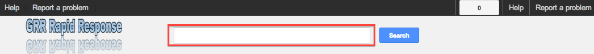
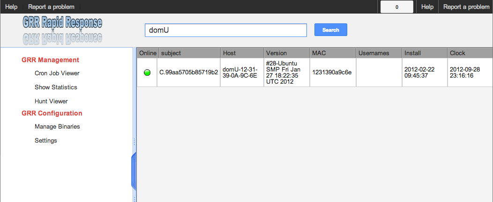
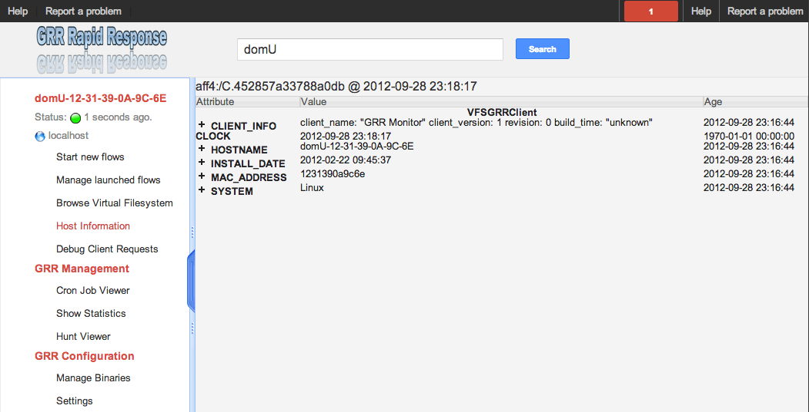
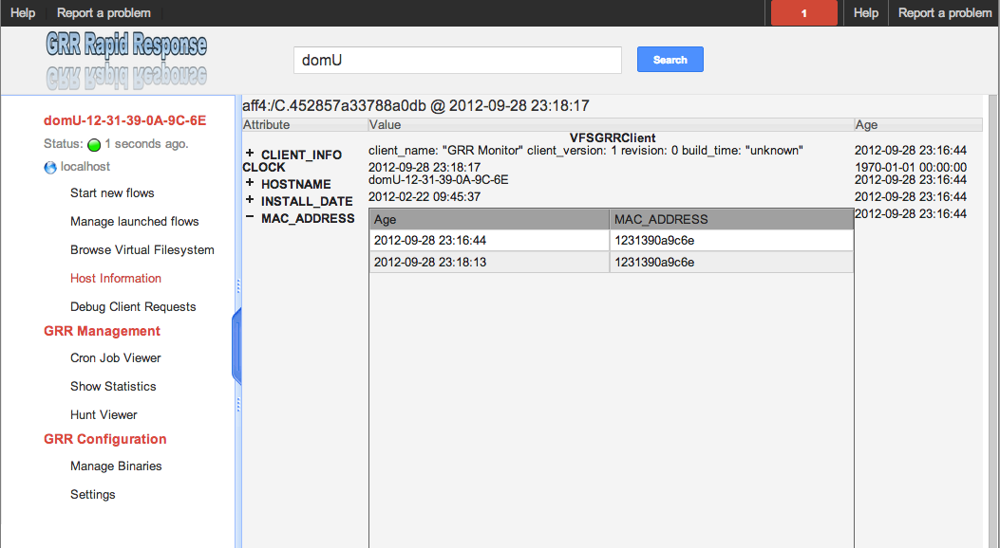
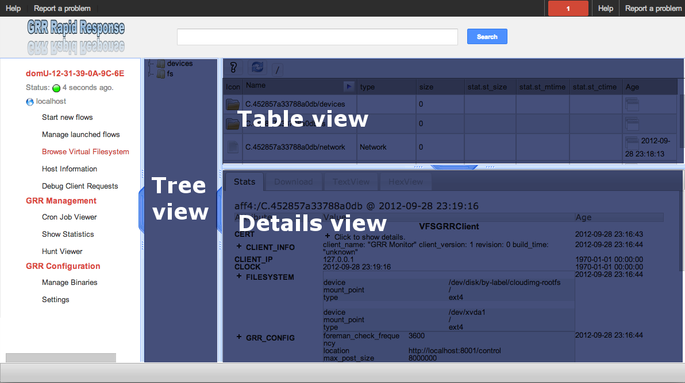
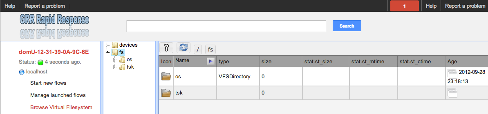
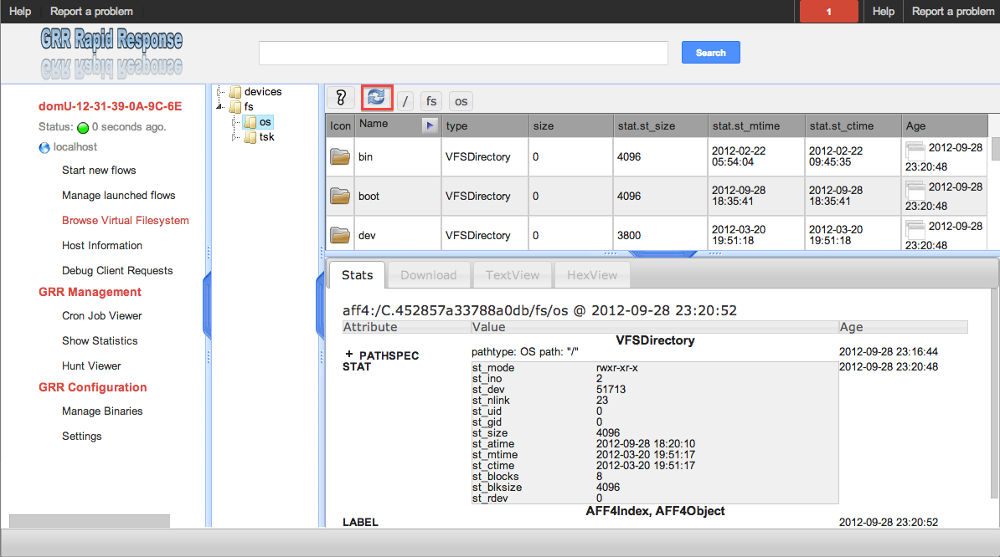
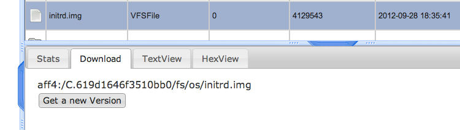
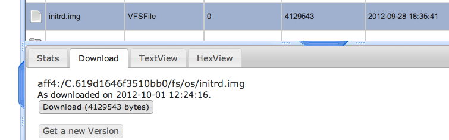
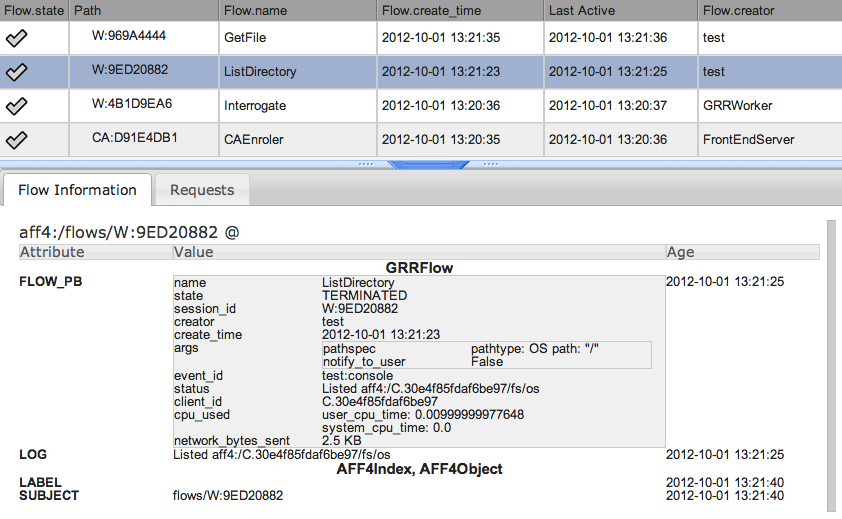

GRR User manual
===============
:toc:
:toc-placement: preamble
:icons:

High-level overview
-------------------

To function, an <<agent,_agent_>> is deployed on systems that one might want to
investigate. Once deployed, each system becomes a GRR <<client,_client_>> and
they can start receiving <<message,messages>> from the frontend servers. Each
message tells the client to run a specific <<client_action,_client action_>> and
return the results. A client action is simply some well known code the agent
knows how to execute (such as obtaining the list of files in a directory or
reading a buffer from a file).

These actions are invoked server-side through what we call <<flow,_flows_>>. A
<<flow,_flow_>> is a piece of server-side code that asks the GRR system to
schedule remote calls to a client and has some additional logic to decide what
to do based on the call results.

This <<flow,_flow_>> is running on a client because a user initiated it. To do
so, he probably used the web-based Graphical User Interface (GUI), which allows
a GRR user to start flows for clients and review the results. Or he could also
have used the text-based <<_the_console,_console_>> to do the same.

Any flow that can be run on a single machine can also be run as a Hunt. A hunt
allows running a flow on all, or any subset of machines talking to the GRR
server.

Getting started
---------------

Once we've got link:admin.html[the GRR server installed and running] we'll want
to start deploying some agents.

To do so we'll need to:

1. Download the specific agent version we need to install on the system.

2. Decide on a deployment method.

3. Perform the deployment and verify the results.

Downloading Agents
~~~~~~~~~~~~~~~~~~
If your install went successfully, the agents should have been uploaded to the
server with working configurations, and should be available in the Admin UI.

Look on the left for "Manage Binaries", the files should be in the executables
directory, under installers. The download button is the down arrown in the
toolbar.

The files are also accessible directly if you know the path via /download. This
is useful if you want to retrieve the file using command line tools or a browser
that isn't supported (e.g. IE6).
-----------------------------------------------------------------
wget --user=admin --password=setecastronomy http://example.com:8080/download/windows/installers/grr-installer-2209.exe
-----------------------------------------------------------------

If your server configuration has changed your agents will need to be repacked
with an updated config. For details see:
link:admin.html#_repacking_the_client_with_a_new_configuration[the GRR server
installed and running]

Installing the Agent
~~~~~~~~~~~~~~~~~~~~
This differs significantly depending on the operating system so we split it into
separate sections below.

If an install is successful, it should appear in the search UI within a few
seconds.

Windows
^^^^^^^
The Windows agents are special self extracting zipfiles. Just double click or
otherwise execute the binary. If you are not an administrator it will prompt
you for credentials.
It should then install silently in the background, unless you enabled the
 link:user_manual.html#_debugging_the_agent_install[verbose build]

Deployment methods
~~~~~~~~~~~~~~~~~~

There are as many deployment methods as code execution paths exist. We'll
discuss some of the most common ways and try to cover each platform.

Windows deployment
^^^^^^^^^^^^^^^^^^

The most straightforward way to deploy a GRR agent to a Windows machine is to
use link:http://technet.microsoft.com/en-us/sysinternals/bb897553.aspx[PsExec].
PsExec allows one to execute commands on a remote system if credentials for a
valid user are known.

To do so, start by downloading psexec and placing in a directory of your choice,
we'll call it AGENT_DIRECTORY here. Store the version of the agent you want to
download to the same directory.

Once you have both, you have to make sure you know the username and password of
an Administrator user in the remote system. Once all these requirements are met,
just start a cmd.exe shell and type:

-----------------------------------------------------------
cd C:\AGENT_DIRECTORY\
net use \\MACHINE\IPC$ /USER:USERNAME *
psexec \\MACHINE -c -f -s agent-version.exe
-----------------------------------------------------------

[NOTE]
==============================================================================
The NET USE command will ask for a password interactively, so it's not suited
for using in scripts. You could Switch the '*' for the PASSWORD instead if you
want to include it in a script.
==============================================================================

You'll need to replace:

- C:\AGENT_DIRECTORY\ with the full path you chose.

- MACHINE with the name of the target system.
- USERNAME with the user with administrative privileges on the target system.

This will copy the agent-version.exe executable on the target system and execute
it. The installation doesn't require user input.

The expected output is something along these lines:

---------------------------------------------------------------------
C:\> cd C:\AGENT_DIRECTORY\
C:\> net use \\127.0.0.1\IPC$ /USER:admin *
Type the password for \\127.0.0.1\IPC$:
The command completed successfully

C:\AGENT_DIRECTORY> psexec \\127.0.0.1 -c -f -s agent.exe
PsExec v1.98 - Execute processes remotely
Copyright (C) 2001-2010 Mark Russinovich
Sysinternals - www.sysinternals.com

The command completed successfully.

agent.exe exited on 127.0.0.1 with error code 0.

C:\AGENT_DIRECTORY>
---------------------------------------------------------------------

For even less footprint on installation you could host the agent on a shared
folder on the network and use this psexec command instead:

------------------------------------------------------------------
cd C:\AGENT_DIRECTORY\
net use \\MACHINE\IPC$ /USER:USERNAME *
psexec \\MACHINE -s \\SHARE\FOLDER\agent-version.exe
------------------------------------------------------------------

This requires the USERNAME on the remote MACHINE be able to log into SHARE and
access the shared folder FOLDER. You can do this either by explicitly allowing
the user USERNAME on that share or by using an Anonymous share.

The best way to verify whether the whole installation process has worked is to
xref:_searching_for_a_client[search for the client in the GUI].

Linux / MacOS X deployment
^^^^^^^^^^^^^^^^^^^^^^^^^^
On linux, the process depends on your environment, if you have a mechanism such
as puppet, then building as a Deb package and deploying that way makes the most
sense.
Alternatively you can deploy using ssh:
------------------------------------------------------------------
scp agent_version.deb host:/tmp/
ssh host sudo dpkg -i /tmp/agent_version.deb
------------------------------------------------------------------

On MacOS X, the same process applies, use puppet or equivalent if you have, or
use ssh.

Deploying at scale
~~~~~~~~~~~~~~~~~~

There shouldn't be any special considerations for deploying GRR clients at
scale. If the server can't handle the load, the clients should happily back off
and wait their turn. However, we recommend a staged rollout if possible.

Debugging the Agent Install
~~~~~~~~~~~~~~~~~~~~~~~~~~~
If the installer is failing to run, it should output a log file which will help
you debug. The location of the logfile is configurable, but by default should
be:

- Windows: %WinDir%\system32\logfiles\GRR_installer.txt
- Linux/Mac OSX: /tmp/grr_installer.txt

To make debugging easier, we also support repacking the client with verbosity
enabled. This is particularly handy on Windows. To repack with this enabled, on
the server you can do:
--------------------------------------------------------------------------------
db@host:~ sudo grr_config_updater --verbose -p ClientBuilder.console=True
repack_clients
--------------------------------------------------------------------------------

Alternatively, you can set ClientBuilder.console: False inside your server
config file to have this setting always applied.

Once you have done this, you can download the new binary from the Web UI. It
should have the same configuration, but will output detailed progress to the
console, making it much easier to debug.

Note that the binary is also a zipfile, you can open it in any capable zip
reader. Unfortunately this doesn't include the built in Windows zip file handler
but does include winzip or 7-zip. Opening the zip is useful for reading the
config or checking that the right dependencies have been included.

Repacking the Windows client in verbose mode enables console output for both the
installer and for the application itself. It does so by updating the header of
the binary at PE_HEADER_OFFSET + 0x5c from value 2 to 3. This is at 0x144 on 64
bit and 0x134 on 32 bit Windows binaries. You can do this manually with a hex
editor as well.

Interactively Debugging the Client
^^^^^^^^^^^^^^^^^^^^^^^^^^^^^^^^^^
On each platform, the agent binary should support the following options:
--verbose::
  This will set higher logging allowing you to see what is going on.
--debug::
  If set, and an unhandled error occurs in the client, the client will break
  into a pdb debugging shell.

--------------------------------------------------------------------------------
C:\Windows\system32>net stop "grr monitor"
The GRR Monitor service is stopping.
The GRR Monitor service was stopped successfully.

C:\Windows\system32>c:\windows\system32\grr\2.5.0.5\grr.exe --config grr.exe.yaml --verbose
--------------------------------------------------------------------------------

--------------------------------------------------------------------------------
test@test0:~$ sudo service grr-single-server stop
[sudo] password for test:
grr-single-server stop/waiting
test@test0:~$ sudo /usr/sbin/grrd --config=/usr/lib/grr/grr_2.9.1.1_amd64/grr.yaml --verbose
INFO:2013-10-02 14:32:07,756 logging:1611] Starting GRR Prelogging buffer.
INFO:2013-10-02 14:32:07,791 logging:1611] Loading configuration from /usr/lib/grr/grr_2.9.1.1_amd64/grr.yaml
--------------------------------------------------------------------------------

Configuration Changes to Ease Debugging
+++++++++++++++++++++++++++++++++++++++
If you are finding that it is slow to debug because the agent starts backed
off to 10 minutes and you have to wait, you should change the configuration.
In windows, set the registry key poll_max to 10, then restart the service. You
can do this with regedit or via the Windows command line:
---------------------------------------------------------------------------
C:\Windows\system32>reg add HKLM\Software\GRR /v Client.poll_max /d 10
The operation completed successfully.

C:\Windows\system32>net stop "grr monitor"
The GRR Monitor service is stopping.
The GRR Monitor service was stopped successfully.

C:\Windows\system32>net start "grr monitor"
The GRR Monitor service is starting.
The GRR Monitor service was started successfully.
---------------------------------------------------------------------------

Changing Logging For Debugging
++++++++++++++++++++++++++++++

On all platforms, by default only hard errors are logged. A hard error is
defined as anything level ERROR or above, which is generally reserved for
unrecoverable errors. But because temporary disconnections are normal, an agent
failing to talk to the server doesn't actually count as a hard error.

In the client you will likely want to set:
Logging.verbose: True

And depending on your configuration, you can play with syslog, log file and
Windows EventLog logging using parameters Logging.path, and Logging.engines.

Uninstalling the Agent
~~~~~~~~~~~~~~~~~~~~~~
On Windows the agent does not have a standard uninstaller. It is designed to
have minimal impact on the system and leave limited traces of itself such that
it can be hidden reasonably easily. Thus it was designed to install silently
without an uninstall.

Disabling the service can be done with the Uninstall flow, but this does not
clean up after itself by default.

Cleaning up the agent is a matter of deleting the service and the install
directory, then optionally removing the registry keys and install log if one
was created, as per below:
---------------------------------------------------------------------------
sc stop "grr monitor"
sc delete "grr monitor"
reg delete HKLM\Software\GRR
rmdir /Q /S c:\windows\system32\grr
del /F c:\windows\system32\grr_installer.txt
---------------------------------------------------------------------------

On OSX you can also use the Uninstall flow.

On Linux the standard system packaging (deb, pkg) is used by default. Use the
standard uninstall mechanisms for this.

Proxies and Connectivity
~~~~~~~~~~~~~~~~~~~~~~~~
If an agent can't connect to the server, there can be a number of reasons such
as:

Server Isn't Listening::
Confirm you can connect to the server and retrieve the server.pem file. E.g.
  `wget http://server:8080/server.pem`

Proxy Required For Access::
If the environment doesn't allow direct connections GRR may need to use a
proxy. GRR currently doesn't support Proxy Autoconfig or Proxy Authentication.
GRR will attempt to guess your proxy configuration, or you can explicitly set
proxies in the config file, e.g.
  `Client.proxy_servers: ["http://cache.example.com:3128/"]`
On Windows systems GRR will try a direct connection, and then search for
configured proxies in all users profiles on the system trying to get a working
connection.
On Linux GRR should obey system proxy settings, and it will also obey
environment variables. e.g.
  `export http_proxy=http://cache.example.com:3128`

Outbound Firewall Blocking Connections::
GRR doesn't do anything to bypass egress firewalling by default. However, if you
have a restrictive policy you could add this as an installer plugin.

If you look at the running config, the first time the client successfully
connects to the server a variable `Client.server_serial_number` will be written
to the config. If that exists, the client successfully made a connection.

The GRR GUI
-----------

Searching for a client
~~~~~~~~~~~~~~~~~~~~~~
In order to start interfacing with a client, we first need to search for it in
the GUI. The GRR search bar is located at the top of the GUI and allows you to
search clients based on their hostname, users available on the system or client
ID.

.GRR search bar

[TIP]
=============================================================================
One can also specify a specific attribute to search for by using the convention
"attribute_name:search_value". So to search for usernames matching john we would
use: user:john.
=============================================================================

We'll use "domU" in our case, as we've installed the agent in a hostname
matching this name. A list of available clients matching your criteria will
show.

.Search results

As you can see, the main panel gets populated with table-based results. Let's go
through each of the columns shown:

- 'Online': An icon indicating whether the host is online or not. Green means
  online; yellow, offline for some time; red, offline for a long time.

- 'subject': The client IDentifier. This is how GRR refers internally to the
  system.

- 'Host': The name of the host as the operating system sees it.

- 'Version': The operating system version.

- 'MAC': A list of MAC addresses of the system.

- 'Usernames': A list of user accounts the operating system knows about (usually
  users local to the system or that have logged in).

- 'Install': The time when the agent was installed on the system.

- 'Clock': The last time the client communicated with a worker.

Once you've found the client you were looking for, click on it and both the left
panel and main panel will change to reflect you're now working with a client.

The client view
~~~~~~~~~~~~~~~

When interfacing with a client the left pane contains additional options. By
default, the Host information view will be active. It shows most of the
information that was available in the search results in an attribute-value. This
is because all of the information relative to the client is stored as an
attribute of it.

.Client view

GRR supports versioning of attributes. This means we store historical data of
each of attribute. Effectively, each attribute value stores both the value and
the time when this value was seen. When different values have been gathered over
time for a specific attribute, a _+_ sign will appear before it in the GUI.
Click on it and it will display a table with all the known values over time.

Additionally, in the listing view, the Age column has a clickable icon that
will show you the different versions of the file that have been collected.

.Versioned MAC address

Listing the Virtual FileSystem
~~~~~~~~~~~~~~~~~~~~~~~~~~~~~~

One of the basic requirements any forensic analyst needs from its tools is to be
able to browse the target system's filesystems. GRR allows you to do so but you
won't find the remote filesystems prepopulated once you add a new client.

First, let's click the 'Browse Virtual Filesystem' option on the left panel to
access this client's VFS.

As you can see, the main pane contains now 3 different subpanels:

- 'Tree view'. Located on the left side, the tree view presents a classical tree
  view of the client's virtual filesystem.

- 'Table view'. The table view shows the contents of whichever node is selected
  on the tree view as a table, showing several (but not all) the attributes of
  objects contained within the selected node.

- 'Details view'. The bottom panel shows details about the node selected on the
  table view. It's a tab based panel that allows to check the node in depth. One
  can see all its attributes, download its contents or see them in the browser
  either on a text based or hex-based view.

.GRR VFS Pane

In order to check contents of the remote filesystem you first need to request a
directory listing. And before that you need to know which drive or volume you
want to list. You can find these under the `fs` (FileSystem) node of the tree
view.

Inside you will find two directories:

1. `os` contains the volumes seen by the Operating System.

2. `tsk` contains volumes seen by sleuthkit when analyzing the partition table
on the remote system.

.GRR VFS fs node

If you try to expand (just click) any of these volumes on a fresh system you
will see they are empty. To list its contents you just need to click on the
refresh button of the table view. This will ask the agent to obtain the
directory and send it back to the server.

Wait just a few seconds and the table view will refresh itself and show the
contents.  Take into account the refresh button only requests a listing of the
current directory in a non-recursive manner.

.GRR VFS Directory listing done

[NOTE]
===============================================================================
What just happened is that the GUI scheduled a Flow to list the directory.  The
agent received it and sent back messages with a list of entries. The frontend
servers picked up the responses and populated the datastore with an object for
each of them. These objects are AFF4 objects and holdsthe filesystem specific
attributes that we store (size on disk, dates, permissions) as attributes of
this object. These AFF4 objects form a hierarchical (tree-like) structure. We
map the filesystem hierarchy to the AFF4 hierarchy and the GUI simply shows you
this list of objects in a custom view, which is the table you're seeing for the
VFS.
===============================================================================

The table view of the VFS shows a few columns by default:

- 'icon'. Shows whether this entry is a file or a directory.

- 'Name'. Contains the name of the file/directory entry.
- 'type'. The GRR object type assigned to this entry.

- 'size'. The object contents size in GRR. 0 in general because you've
  downloaded no content so far.
- 'stat.st_size'. The file/directory contents size on the remote filesystem.

- 'stat.st_mtime'. The file/directory last written time in UTC on the remote
  filesystem.
- 'stat.st_ctime'. The file/directory creation time in UTC on the remote
  filesystem..
- 'age'. The time at which all of this information was stored.

Now try clicking on any entry in the table view and the details view will
populate with data from this file.

The details view has four tabs you can use. The default one is `Stats` and it
shows all the attributes for the selected node. It should look familiar to you
as it's pretty much as the `Host Information` page you see where you can find
information about the client object.

The rest are discussed in the next section.

Downloading Files
~~~~~~~~~~~~~~~~~

The easiest way to download a file is through the GUI. To do so, you first have
to list the directory it's in and browse there with the GUI.

Select the file on the table panel and click the 'Download' tab on the details
view. By clicking on 'Get new version' you will issue a Flow to download the
given file. The client will transfer the given file by creating messages with
the file contents and it will be stored in the GRR datastore.

.Download tab

Once the file is downloaded, a new button will appear in this view above the
'Get new version' button called 'Download'. As you guessed, this allows you to
download the file from the GRR datastore to your computer.

.Downloaded file

File Versions
~~~~~~~~~~~~~
One interesting property of GRR that may not be immediately obvious, is that
every object is versioned with it's age, and for the most part, we keep old
versions instead of overwriting them. This means that if you Schedule listing of
a directory once a day, you will end up with a historical daily record of that
directory. You can click on the icon in the Age column to show a list of all
the versions of a file we have collected.

In some cases, different versions of the object may have different types
depending on how it was retrieved. A common case of this is for files. If you
list a directory, the file entry will be a Stat, but if you download the same
file, you will get a HashImage.

This can lead to confusion. If you download a file, then list the directory,
the downloadable HashImage may seem to disappeared due to the default view only
showing latest version of the file. You will need to click the Age icon to
access the previous version.

[CAUTION]
================================================================================
For safety reasons, GRR appends ".noexec" to the name of every file you request
to download to your computer.
================================================================================

Specifying File Paths
---------------------
Providing file names to flows is a core part of GRR, and many flows have been
consolidated into the File Finder flow, which uses a glob+interpolation syntax.

File Path Examples
~~~~~~~~~~~~~~~~~~
All executables or dlls in the user's download directory:
---------------------------------------
%%users.homedir%%\Downloads\*.{exe,dll}
---------------------------------------
All .evtx files found up to three directories under C:\Windows\System32\winevt:
----------------------------------------------
%%environ_systemroot%%\System32\winevt\**.evtx
----------------------------------------------
"findme.txt" files in user homedirs, up to 10 directories deep:
---------------------------------
%%users.homedir%%/**10/findme.txt
---------------------------------

[NOTE]
================================================================================
Either forward "/home/me" or backslash "C:\Users\me" path specifications are
allowed for any target OS.  They will be converted to a common format
internally.  We recommend using whatever is normal for the target OS: (backslash
for Windows, fwdslash for OS X and Linux).
================================================================================

File Path Interpolation
~~~~~~~~~~~~~~~~~~~~~~~

GRR supports path interpolation from values in the artifact Knowledge Base.
Interpolated values are enclosed with %%, and may expand to multiple elements.
e.g.
--------------------------
%%users.homedir%%\blah.txt
--------------------------

Might expand to the following paths:
---------------------------------------------------------------------
C:\Users\alice\blah.txt, C:\Users\bob\blah.txt, C:\Users\eve\blah.txt
---------------------------------------------------------------------

A full list of possible interpolation values can be found by typing %% in the
gui.

Path Globbing
~~~~~~~~~~~~~

Curly braces work similarly to bash, e.g:
-------------------
{one,two}.{txt,doc}
-------------------

Will match: one.txt, two.txt, one.doc, two.doc

Recursive searching of a directory is performed with **.  The default search
depth is 3 directories.  So:
------------
/root/**.doc
------------

Will match:
-----------------------
/root/blah.doc
/root/1/something.doc
/root/1/2/other.doc
/root/1/2/3/another.doc
-----------------------

More depth can be specified by adding a number to the **, e.g. this performs
the same search 10 levels deep:
--------------
/root/**10.doc
--------------

Grep Syntax
-----------
A number of GRR flows (such as File Finder and Memory Collector) accept Grep
specifications, which are a powerful way to search file and memory contents.
There are two types of grep syntax: literal and regex.

Literal Matches
~~~~~~~~~~~~~~~
Use this when you have a simple string to match, or want to match a byte string.
Here's a simple string example (note no quotes required):
-----------
allyourbase
-----------
And a byte string example:
------------------------------------------
MZ\x90\x00\x03\x00\x00\x00\x04\x00\x00\x00
------------------------------------------

To minimise the potential for errors we recommend using python to create byte
strings for you where possible, e.g.  the above byte string was created in
ipython like this:
----------------------------------------------------
In [1]: content = open("test.exe","rb").read(12)

In [2]: content
Out[2]: 'MZ\x90\x00\x03\x00\x00\x00\x04\x00\x00\x00'
----------------------------------------------------

Regex Matches
~~~~~~~~~~~~~
Use this when you need more complex matching. The format is a regular python
regex (see http://docs.python.org/2/library/re.html) with the following switches
applied automatically:
----------------------------------------
re.IGNORECASE | re.DOTALL | re.MULTILINE
----------------------------------------
An example regex is below. The entire match is reported, () groups are not
broken out separately.  Also note that 10 bytes before and after will be added
to any matches by default - use the Advanced menu to change this behavior:
-----------------------------------------------------
Accepted [^ ]+ for [^ ]+ from [0-9.]+ port [0-9]+ ssh
-----------------------------------------------------

Advanced Options
~~~~~~~~~~~~~~~~
The default options under the 'Advanced' menu should be fine for most
situations, but this is where you can specify byte offsets and lengths, and how
much context to retrieve around matches.

The Virtual Filesystem
----------------------
_TODO_

Flows
-----

When designing GRR, one of the main goals was achieving great scalability.  One
of the main resource hogs with the client-server model is that while a client is
active all resources that might have been needed on the server side to
communicate with it and do processing are held (think temporary buffers,
sockets, file descriptors...). Even when the client itself is doing operations
that take time such as heavy computations or waiting on I/O, resources are held
on the server.

When trying to deal with thousands of clients at the same time, this would
translates into the server hoarding many unneeded resources.

To solve the resource hogging problem, Flows were created. Flows are the
server-side code entities that call client actions. These calls are done
asynchronously. That is, they are requested and their results become available
later on. Flows are like a state machine, where transition between states
happens when the results of client actions return to the server. So here's what
happens when the GRR server launches a typical Flow.

1. The GRR server executes the initial Flow state.

2. This state asks for one or more client actions to be performed on the client.

3. The server clears all the resources this Flow has requested and waits for
responses from the client to come back.

4. When responses are received, the server fetches all the needed resources
again and runs the Flow state where it expects these responses. If more client
actions are requested by this state it goes back to step 2. Otherwise...

5. The results of this Flow are stored and the flow state is updated.

Flows have a second very interesting property. For flows that make use of some
of the most primitive client actions, because all of the logic is encapsulated
on the server side and the client doesn't have any state at all, they naturally
survive reboots while processing is taking place.

Now, whether you've been following the <<_getting_started,'Getting started'>>
chapter or not, as long as you have a client communicating with the server you
can already check some flows in the GUI. While having selected a client in the
GUI, click on the 'Manage launched flows' link on the left panel.  This will
bring you to a view that shows all the Flows that have been requested on this
client.

.Launched flows view
image::images/grr-gui-flows-main.png[width=850,align="center"]

The flows view resembles very much the VFS view. Indeed, the GUI reuses
table-detail panels on many of the views. The table view shows the current state
of the flow, what's the flow identifier ('Path'), the name of the Flow launched,
the date when it was launched, when it was last active and who created it.

As you can see, 4 Flows have been launched in the shown example:

1. 'CAEnroler'. This is the first flow ever to launch for any client. It is the
enroling Flow which gets the client set up server side.

2. 'Interrogate'. After enroling, a client sends some information about the
machine it's running in such as the hostname, MAC address or users available
on the system. This is the flow that fetches this information and if you
remember the 'Host Information' option, most information is contained there.

3. 'ListDirectory'. A Flow that lists the contents of a directory. This is what
happened when the refresh button was pressed on the GUI.

4. 'GetFile'. A flow to download a specific file on a client. This is the flow
that got launched when we asked to download a file through the GUI.

[IMPORTANT]
===============================================================================
The list of flows doesn't auto-refresh at the moment. To see it updated you will
have to manually refresh it by clicking on the 'Manage launched flows' option
again.

Clicking on an individual flow to see its details, however, DOES get fresh
information from the datastore.
===============================================================================

Let's see the 'ListDirectory' flow in detail. You can click on any flow to get
detailed information.

.ListDirectory flow details

There's a lot of information here. Again, all these values are attributes. The
most interesting bits are the flow 'state', which tells us whether it finished
correctly (oddly named *TERMINATED*) or not (*ERROR*), or if it's still running
(*RUNNING*). The 'args', which are the specific arguments that were passed to
it. Finally, the 'LOG' attribute holds a list of messages the Flow generated.

Launching flows manually
~~~~~~~~~~~~~~~~~~~~~~~~

We've seen how Flows were created through the UI. Now, we are gonna issue our
own 'ListDirectory' flow, giving it parameters and then you can check the
<<_available_flows,available flows>> list to decide what else you might want to
run on your client.

To start a new Flow simply click on the 'Start new flows' option on the left
panel. The main panell will populate with the holy trinity of panels. The tree
view shows all the Flows organized by category.

Expand the 'FileSystem' category and select the 'ListDirectory' flow. The flow
view will populate with a form with all the user-configurable parameters for
every flow. What's more, because each parameter has a well-defined type, GRR
shows you nice widgets to select a value for each of them.

The ListDirectory flow accepts three parameters (the client ID is implicit in
the GUI):

1. 'path'. This is the textual path that you want listed.

2. 'pathtype'. Which VFS handler you want to use for the path. Available options
are:
  - *OS*. Uses the OS "open" facility. These are the most straightforward for a
    first user. Examples of 'os' paths are +C:/Windows+ on Windows or
    +/etc/init.d/+ on Linux/OSX.

  - *TSK*. Use Sleuthkit. Because Sleuthkit is invoked a path to the device is
    needed along the actual directory path. Examples of 'tsk' paths are
    +\\?\Volume\{19b4a721-6e90-12d3-fa01-806e6f6e6963\}\Windows+ for Windows or
    +/dev/sda1/init.d/+ on Linux. The specific path will vary from client to
    client.

  - *REGISTRY*. Windows-related. You can open the live Windows registry as if it
    was a virtual filesystem.a So you can specify a 'path' such as
    +HKEY_LOCAL_MACHINE/Select/Current+.

  - *MEMORY*. Access the client memory.

3. 'Priority'. Three thresholds are given to flows. The higher priority flows
take precedence executing over lower priority ones. By default all flows are
scheduled as Medium priority. In general, you shouldn't change this parameter.

Once you've filled in each required field, click on 'Launch' and if all
parameters validated, the Flow will run. Now you can go to the 'Manage launched
flows' view to find it running or track it.

[IMPORTANT]
===============================================================================
Not all flows might be available on every platform. When trying to run a flow
that's not available in the given platform an error will show up.
===============================================================================

Available flows
~~~~~~~~~~~~~~~

The easiest ways to see the current flows is to check in the AdminUI under
StartFlow. These have useful documentation.

Note that by default only BASIC flows are shown in the Admin UI. By clicking
the settings (gear icon) in the top right, you can enable ADVANCED flows. With
this set you will see many of the underlying flows which sometimes be useful,
but require a deeper understanding of GRR.

Hunting
-------
Hunting is one of the key features of GRR. Anything you can do on a single
client, should be able to be done on thousands of clients just as easily.

A hunt specifies a Flow, the Flow parameters, and a set of rules for which
machines to run the Flow on.

Creating a Hunt
~~~~~~~~~~~~~~~
You can create a new Hunt in the Hunt Manager section of the UI. To create a
Hunt:

. Click the + button
. Fill out the details of the flow you want to run
. Set Hunt parameters
.. Client Limit - The maximum number of clients to run on (note this number
   is considered a soft limit for technical reasons, we may slightly overshoot)
.. Expiry Time - Stop queuing flows for new clients that appear after this
   amount of time.
. Select rules.
.. By default you'll want to choose a specific platform, e.g. Windows
.. You can however make arbitrary rules based on attributes of the client. E.g.
   a regex match to ensure to check the that the Version attribute at / matches
   2.5.2.*
. Click Run

Unless approvals are required, the hunt should begin running immediately.

Why Is My Hunt Doing Nothing?
~~~~~~~~~~~~~~~~~~~~~~~~~~~~~
- There are caches involved in the frontend server, you may need to wait a
couple of minutes before the first client picks up the flow.
- Clients only check if there is hunt work to do according to the
`Client.foreman_check_frequency` parameter. This should default to every 10
minutes as of version 0.2-9. Note that when a client issues a foreman check,
flows are not directly queued on the client. Instead, the process is
asynchronous, so the check tells the server to check its hunt rules to see if
there are things for the client to do, if there are, it schedules them. However,
if the client is in slow poll mode, it may not poll and pick up that work for
another `Client.poll_max period` (10 minutes by default).

Exporting Data From GRR
-----------------------
Extracting bulk data from the GRR datastore using the UI is slow and cumbersome.
It is possible to use the console to extract any data you wish, but we also
provide a tool called file_exporter, and a FUSE layer.

Exporting a Single File
~~~~~~~~~~~~~~~~~~~~~~~

--------------------------------------------------------------------------
db@grrhost: ~$ grr_file_exporter --file=aff4:/C.123456890ABCDEF/fs/os/boot.ini --output=/tmp
Using configuration <ConfigFileParser filename="/etc/grr/grr-server.conf">
Downloading: aff4:/C.123456890abcdef/fs/os/boot.ini to: /tmp/C.123456890abcdef/fs/os/boot.ini

db@grrhost: ~$
--------------------------------------------------------------------------

Exporting a Directory
~~~~~~~~~~~~~~~~~~~~~
Directories can be exported recursively
--------------------------------------------------------------------------
db@grrhost: ~$ grr_file_exporter --directory=aff4:/C.123456890ABCDEF/fs/os/ --output=/tmp --overwrite --depth=4
Downloading: aff4:/C.123456890abcdef/fs/os/boot.ini to: /tmp/C.123456890abcdef/fs/os/boot.ini
Downloading: aff4:/C.123456890abcdef/fs/os/tmp1 to: /tmp/C.123456890abcdef/fs/os/tmp1

db@grrhost: ~$
--------------------------------------------------------------------------

Exporting a Collection
~~~~~~~~~~~~~~~~~~~~~~
An RDFValueCollection is a collection of objects, often URNs or StatEntry
objects which reference files that have been downloaded. These are often created
as the output of hunts and it is common to want to download all these files to
disk so you can work with them easily.

You need to pass in a URN, and by default we will download files from the
collection to the directory you specify under the full aff4 path.

For collections we support downloading multithreaded, which speeds things up
significantly.
In addition, for collections, by default dump a yaml file of the client data to
the root of the client directory, e.g. C.123456890abcdef/client_info.yaml.
This is useful for identifying which machine the files came from when working on
the filesystem.

--------------------------------------------------------------------------
db@grrhost: ~$ grr_file_exporter --collection=aff4:/hunts/W:123456/Results --output=/tmp
--------------------------------------------------------------------------

The Console
-----------

The GRR console `grr_console` gives you an interactive ipython shell with all
the right imports to do pretty much whatever you want.

Running a Simple Flow - List Processes
~~~~~~~~~~~~~~~~~~~~~~~~~~~~~~~~~~~~~~

Run the ListProcesses flow and look at the output.

[NOTE]
=====================================================
"C.93ce669b1b0c76b6" is the client you want to run the flow on (get it from the gui).
=====================================================

[source, shell]
--------------------------------------------------------------------------
grr_console

In [31]: flow.GRRFlow.ListProcesses?
Type:       MetaclassRegistry
String Form:<class 'grr.lib.flows.general.processes.ListProcesses'>
File:       /usr/lib/python27/dist-packages/grr/lib/flows/general/processes.py
Docstring:
List running processes on a system.

Call Spec:
  flow.GRRFlow.StartFlow(client_id=client_id, flow_name="ListProcesses")

Args: None

In [32]: flow.GRRFlow.StartFlow(client_id='C.93ce669b1b0c76b6', flow_name="ListProcesses")
I0814 17:24:38.813689 24346 flow.py:810] Scheduling aff4:/C.93ce669b1b0c76b6/flows/W:52EBD0A7(ListProcesses) on aff4:/C.93ce669b1b0c76b6: {}
Out[32]: <aff4:/C.93ce669b1b0c76b6/flows/W:52EBD0A7 age=1970-01-01 00:00:00>

### Alternatively you could use StartFlowAndWait to do the same thing but block while the flow is running like this:
# flow_utils.StartFlowAndWait('C.93ce669b1b0c76b6', "ListProcesses")

In [33]: processes_fd = aff4.FACTORY.Open("aff4:/C.93ce669b1b0c76b6/processes", mode="r")

In [34]: plist = processes.Get(processes.Schema.PROCESSES)

In [35]: print plist[0].exe
/sbin/init

In [36]: print plist[0]
message Process {
 RSS_size : 2805760
 VMS_size : 21372928
 cmdline : [
   u'/sbin/init'
  ]
 ctime : 1376328450160000
 effective_gid : 0
 effective_uid : 0
 exe : u'/sbin/init'
 memory_percent : 0.0110976351425
 name : u'init'
 nice : 0
 num_threads : 1
 pid : 1
 real_gid : 0
 real_uid : 0
 saved_gid : 0
 saved_uid : 0
 status : u'sleeping'
 system_cpu_time : 6.65999984741
 user_cpu_time : 2.36999988556
 username : u'root'
}

GRR's FUSE layer
-----------

GRR's FUSE layer allows you to mount remote filesystems at directories in your
machine. Run it by running `grr_fuse`. For configuration options, see
grr/tools/fuse_mount.py

By default `grr_fuse` will mount the root AFF4 directory, so you'll be able to
cd into any client from there. It's also possible to mount at arbitrary URNs
using the --aff4_path flag to fuse_mount.py.

Example invocation:
`grr_fuse` --mountpoint=/mnt/aff4

While using the FUSE layer, flows will be run on the client to update
files/directories, so some commands (e.g. ls) might be slow the first time they
are run. Results are cached so that subsequent calls (e.g. in tab completion) do
not need to make a request to the client. The cache is time based, so any files
older than the expiry time will be refreshed from the client. The default cache
time is 5 minutes, and can be set with the --max_age_before_refresh flag in
grr/tools/fuse_mount.py

--------------------------------------------------------------------------

Timeline
--------
GRR currently contains rudimentary support for timelining and timeline
visualization through the MACTimes flow. When you run this flow it will be
executed server side and will create a timeline collection containing all
events that you specified in the flow.

If you view the results from this flow, you will see a GRRTimeSeries, which
when selected should give you a link to View Details. Clicking on that link will
take you to the Timeline view.

Within the timeline view you can download the timeline as a CSV file, or you
can also do basic filtering in the GUI. Filters work against the objects stored
as events in timeline.

Below are some example filters that might be of use:

[source,python]
-------------------------------------------
event.stat.st_size = 403
event.timestamp > 2012
event.timestamp > 2012-03-01 and event.timestamp < 2013-12-01-13:04:23
event.subject contains exe
event.subject matches ini$
-------------------------------------------

Glossary
--------

[[aff4]] AFF4::
AFF4 is the data model used for storage in GRR, with some minor extensions. You
can read about the usage in the GRR paper linked above and there is additional
detail linked at http://www.forensicswiki.org/wiki/AFF4

[[agent]] Agent::
A platform-specific program that is installed on machines that one might want to
investigate. It communicates with the GRR server and can perform client actions
at the server's request.

[[client]] Client::
A system that has an agent installed. Also used to refer to the specific
instance of an agent running in that system.

[[client_action]] Client Action::
A client action is an action that a client can perform on behalf of the server.
It is the base unit of work on the client. Client actions are initiated by the
server through Flows.  Example client actions are ListDirectory,
EnumerateFilesystems, Uninstall.

[[collection]] Collection::
A Collection is a logical set of objects stored in the AFF4 database. Generally
these are a list of URNs containing a grouping of data such as Artifacts or
Events from a client.

[[datastore]] DataStore::
The backend is where all AFF4 and Scheduler data is stored. It is provided as an
abstraction to allow for replacement of the datastore without significant
rewrite. The datastore supports read, write, querying and filtering.

[[flow]] Flow::
A logical collection of server or client actions which achieve a given
objective. A flow is the core unit of work in the GRR server. For example a
BrowserHistory flow contains all the logic to download, extract and display
browser history from a client. Flows can call other flows to get their job
done. E.g. A CollectBrowserHistory flow might call ListDirectory and GetFile to
do it's work. A flow is implemented as a class that inherits from GRRFlow.

Frontend server::
Server-side component that sends and receives messages back and forth from
clients.

[[hunt]] Hunt::
A Hunt is a mechanism for managing the execution of a flow on a large number of
machines. A hunt is normally used when you are searching for a specific piece of
data across a fleet of machines. Hunts allow for monitoring and reporting of
status.

[[message]] Message::
Transfer unit in GRR that transports information from a Flow to a client and
viceversa.

[[worker]] Worker::
Once receiving a message from a client a worker will wake up the Flow that
requested its results and execute it.

